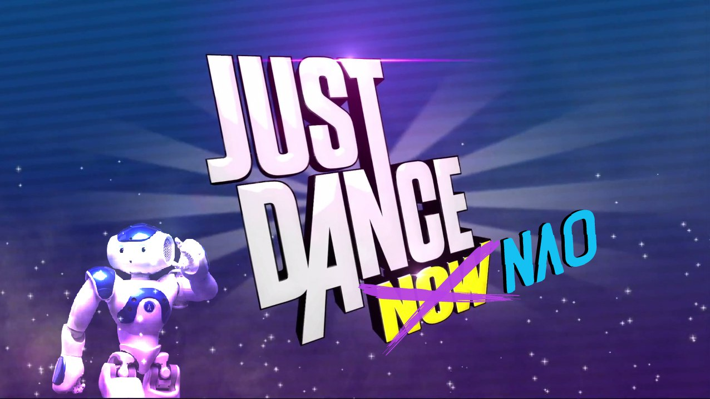

# Just-Dance-NAO

**Team Name: Just Dance NAO**  

Fundamentals of Artificial Intelligence and Knowledge Representation  
NAO Planning Competition 2019  

## Getting Started
1. Open the Command Prompt  
2. Change the directory to the project folder  
3. Launch the project by typing: `just_dance_nao.py --port YourNAORobotPortNumber`   

### Prerequisites
- Choregraphe suite
- py_plan - https://pypi.org/project/py-plan/ 
- py_search - https://pypi.org/project/py-search/ 
- pygame - https://pypi.org/project/pygame/ 
- mutagen - https://pypi.org/project/mutagen/ 

## Authors

**Simone Gayed Said** - simone.gayed@studio.unibo.it  
**Pietro Obbiso** - pietro.obbiso@studio.unibo.it  
**Ramsiya Ramanathan** - ramsiya.ramanathan@studio.unibo.it  

## Useful Links

**Special Movements** - https://funlab.nd.edu/the-nao-base/special-movements/  
**Spotify playlist** - https://open.spotify.com/playlist/3nBdD3CigeiexPsubKnCxb?si=BkxprH0FSWOMZ9PjHQ9bkA

